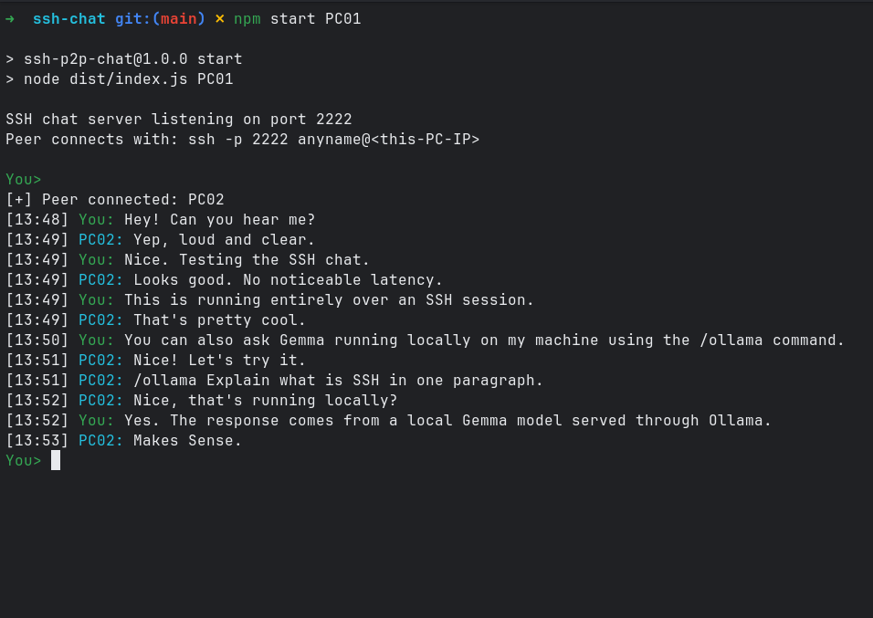
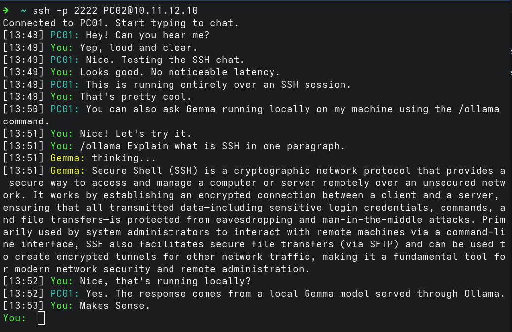

# SSH P2P Chat

A terminal-first peer-to-peer chat application built over SSH with local AI integration via Ollama.

## Overview
A minimal, peer-to-peer terminal chat application built over SSH using Node.js. It facilitates direct point-to-point communication over a secure SSH tunnel without relying on an intermediary server. The application includes native integration with local Large Language Models (LLMs) via the Ollama API, allowing both peers to execute inference directly within the chat stream.

## Screenshots

| Host | Peer |
|------|------|
|  |  |

## Example Session

```text
➜  ~ ssh -p 2222 PC02@10.11.12.10
Connected to PC01. Start typing to chat.
[13:48] PC01: Hey! Can you hear me?
[13:49] You: Yep, loud and clear.
[13:49] PC01: Nice. Testing the SSH chat.
[13:49] You: Looks good. No noticeable latency.
[13:49] PC01: This is running entirely over an SSH session.
[13:49] You: That's pretty cool.
[13:50] PC01: You can also ask Gemma running locally on my machine using the /ollama command.
[13:51] You: Nice! Let's try it.
[13:51] You: /ollama Explain what is SSH in one paragraph.
[13:51] Gemma: thinking...
[13:51] Gemma: Secure Shell (SSH) is a cryptographic network protocol that provides a secure way to access and manage a computer or server remotely over an unsecured network. It works by establishing an encrypted connection between a client and a server, ensuring that all transmitted data-including sensitive login credentials, commands, and file transfers-is protected from eavesdropping and man-in-the-middle attacks. Primarily used by system administrators to interact with remote machines via a command-line interface, SSH also facilitates secure file transfers (via SFTP) and can be used to create encrypted tunnels for other network traffic, making it a fundamental tool for modern network security and remote administration.
[13:52] You: Nice, that's running locally?
[13:52] PC01: Yes. The response comes from a local Gemma model served through Ollama.
[13:53] You: Makes Sense.
You:
```

## Features
- **P2P SSH Chat**: Direct connection architecture using an Ed25519 host key.
- **Dynamic Model Inference**: `/ollama <prompt>` invokes a REST call to `127.0.0.1:11434`. Models are dynamically auto-selected via the `/api/tags` endpoint. AI requests are executed on the host's local Ollama instance, and responses are streamed back to both participants.
- **Customizable Host Identity**: Overridable host display name via command-line execution parameters.
- **Color-Coded Streams**: Dedicated terminal colors distinguishing between local input, remote input, and LLM inference.

## Tech Stack

- Node.js
- TypeScript
- ssh2
- Ollama
- ANSI Terminal Escape Codes

## Architecture

- SSH transport via `ssh2`
- Event-driven networking
- Terminal-native interface
- Single active peer per session
- Local AI inference through Ollama

```text
Host Terminal
      │
      ▼
SSH Server ───────── SSH Channel ───────── SSH Client
      │                                      │
      ▼                                      ▼
  Ollama API                           Peer Terminal
```

## Why SSH?

Instead of building a custom encrypted transport layer, this project uses SSH to provide secure communication, authentication, and encrypted channels while allowing the focus to remain on terminal interaction and message handling.

## Installation and Setup

### Prerequisites
- Node.js (v18 or higher recommended for native Fetch API support)
- Ollama (optional, required for local LLM features)

### Installation
```bash
npm install
npm run build
```

### Key Generation
Before initiating the server, generate an Ed25519 host key in the project root:
```bash
ssh-keygen -t ed25519 -f host_key -N ""
```

## Usage

### Start the Host
Initiate the server process. Optionally, append a custom display name as a process argument. The server defaults to port 2222.
```bash
npm run start [CustomName]
```

### Connect from a Peer
A peer can connect via standard SSH tools. 

> **Note**
>
> This prototype accepts any SSH authentication attempt and is intended
> for experimentation on trusted networks only.
> Public key authentication is planned.

```bash
ssh -p 2222 anyname@<host-ip>
```

## Commands
- `/ollama <prompt>`: Dispatches the prompt to the host's local Ollama instance and streams the response back to both the host and peer outputs.

### Selecting a Specific Model
By default, the application dynamically selects the first available model returned by the Ollama API. If you maintain multiple models and wish to strictly enforce a specific one, you can configure it via the `OLLAMA_MODEL` environment variable (or within your `.env` file):
```bash
OLLAMA_MODEL=gemma4:26b npm start
```

## Roadmap

- [ ] Multi-peer support
- [ ] Public key authentication
- [ ] File transfer
- [ ] End-to-end encryption
- [ ] Improved terminal UI

## License

MIT
